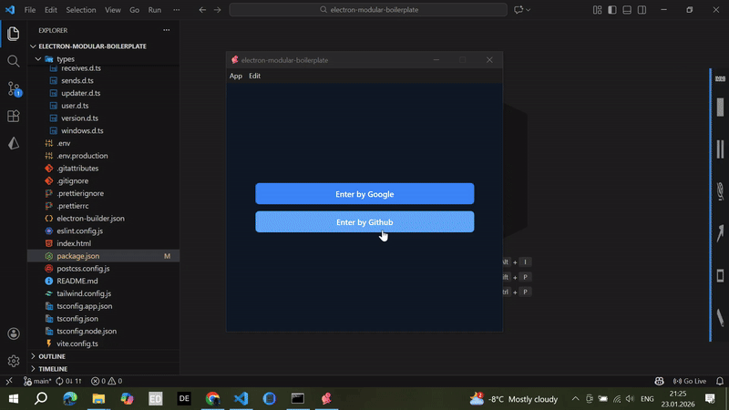
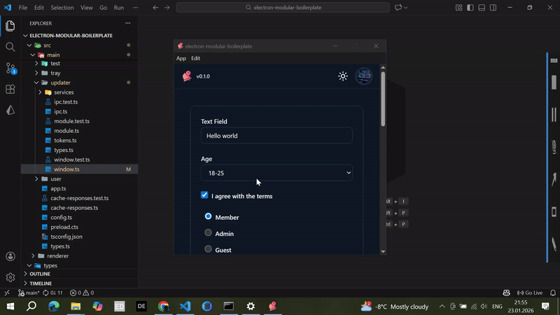

# Electron Modular Boilerplate

A **production-ready** Electron starter template featuring **React 19**, **TypeScript**, **Tailwind CSS**, and a **modular architecture** powered by `@devisfuture/electron-modular`. This boilerplate comes with pre-configured OAuth authentication (Google, GitHub), auto-update logic, comprehensive unit testing, and ready-to-use AI Agent documentation for GitHub Copilot.

[](https://github.com/trae-op/electron-modular-boilerplate/actions/workflows/build.yml)

---

## Table of Contents

- [🎯 Project Overview](#-project-overview): Overview of the boilerplate's features and goals.
- [🚀 Features](#-features): Core technologies used in the project.
- [🏗️ Architecture](#-architecture): Explanation of the main and renderer process architecture.
- [🔐 OAuth Authentication Flow](#-oauth-authentication-flow): Details about the OAuth 2.0 implementation.
- [🔄 Auto-Update System](#-auto-update-system): Description of the auto-update functionality.
- [📡 Type-Safe IPC Communication](#-type-safe-ipc-communication): Overview of the IPC communication setup.
- [🧪 Testing](#-testing): Information about the testing setup and structure.
- [📚 AI Agent Documentation](#-ai-agent-documentation): Guides for GitHub Copilot and AI agents.
- [📦 Installation](#-installation): Steps to set up the project locally.

---

## Project Overview

This is a **full-featured starter kit** designed to accelerate Electron application development. Whether you're building a desktop app from scratch or migrating an existing project, this boilerplate provides:

- **Modular architecture** with Dependency Injection (DI) pattern
- **Production-ready authentication** with OAuth 2.0 (Google, GitHub)
- **Auto-update system** using `electron-updater`
- **Type-safe IPC communication** between renderer and main processes
- **Modern React stack** with hooks, context patterns, and virtualized lists
- **Comprehensive testing setup** with Vitest
- **CI/CD pipeline** with GitHub Actions
- **AI-friendly documentation** optimized for GitHub Copilot

---

## Demo: Reusable authentication and custom UI



## Auto-update Demo



## Features

### Core Technologies

#### **Frontend (Renderer Process)**

- ⚛️ **React 19** - Latest React with concurrent features
- 🎨 **Tailwind CSS 3.4** - Utility-first CSS framework
- 🧭 **React Router DOM 7** - Hash-based routing for Electron
- 📦 **Vite 6** - Lightning-fast development server and build tool
- 🎭 **Lucide React** - Beautiful icon library
- 📊 **React Window** - Virtualized lists for performance
- 🔄 **React Virtualized Auto Sizer** - Auto-sizing for virtualized components

#### **Backend (Main Process)**

- 🔌 **Electron 38** - Latest Electron with modern APIs
- 🏗️ **@devisfuture/electron-modular** - Dependency Injection framework
- 🔐 **OAuth 2.0 Authentication** - Google, GitHub
- 📡 **Axios** - HTTP client for REST API calls
- 💾 **Electron Store** - Persistent storage with encryption support
- 📝 **Electron Log** - Production-grade logging
- ⬆️ **Electron Updater** - Auto-update functionality
- 🔧 **Electron Builder** - Multi-platform builds (Windows, macOS, Linux)

#### **Development Tools**

- 📘 **TypeScript 5.7** - Strict type checking
- ✅ **ESLint 9** - Code linting with TypeScript support
- 💅 **Prettier 3.7** - Code formatting with import sorting
- 🧪 **Vitest 3** - Fast unit testing framework
- 🎭 **Testing Library** - React component testing utilities
- 📦 **PostCSS + Autoprefixer** - CSS processing

---

## Architecture

### Main Process Architecture

The main process uses a **modular architecture** with Dependency Injection:

```architecture
src/main/
├── app.ts                    # Application entry point
├── config.ts                 # Global configuration
├── preload.cts              # Preload script for IPC bridge
├── @shared/                 # Shared utilities
│   ├── store.ts            # State management (Map + electron-store)
│   ├── logger.ts           # Logging utilities
│   ├── ipc/                # IPC type-safe helpers
│   └── error-messages.js   # Error notification system
├── app/                     # Main application module
│   ├── module.ts           # Module registration
│   ├── service.ts          # Business logic
│   ├── ipc.ts             # IPC handlers
│   └── window.ts          # Window manager
├── auth/                    # OAuth authentication module
│   ├── module.ts
│   ├── service.ts         # Auth logic (logout, storage cleanup)
│   ├── ipc.ts            # Auth IPC handlers
│   └── window.ts         # OAuth popup window manager
├── user/                    # User data module
│   ├── module.ts
│   └── service.ts         # User API calls
├── rest-api/                # HTTP client module
│   ├── module.ts
│   └── service.ts         # Axios wrapper with caching
├── updater/                 # Auto-update module
│   ├── module.ts
│   ├── services/          # Update logic for Windows/macOS
│   └── window.ts          # Update notification window
├── notification/            # System notifications
├── menu/                    # Application menu
└── tray/                    # System tray icon
```

**Key Concepts:**

- Each feature is a **self-contained module** with clear responsibilities
- **Services** handle business logic and are auto-injected via `@Injectable()`
- **IPC Handlers** manage renderer ↔ main communication with `@IpcHandler()`
- **Window Managers** control window lifecycle with `@WindowManager()`
- **Tokens** enable custom dependency injection

### Renderer Process Architecture

The renderer follows a **domain-driven design** with React:

```architecture
src/renderer/
├── App.tsx                 # App shell with providers + router
├── main.tsx                # React entry point
├── components/             # Reusable UI primitives
│   ├── Button/
│   ├── IconButton/
│   ├── Avatar/
│   ├── Popover/
│   ├── List/
│   └── TextField/
├── composites/             # Cross-cutting feature blocks
│   ├── Routes/            # Public/Private route guards
│   ├── LightDarkMode/     # Theme toggle
│   ├── LazyRender/        # Virtualized list renderer (react-window + AutoSizer) - renders only visible items for large collections
│   └── AppVersion/        # Version display
├── conceptions/            # Domain modules (feature packages)
│   ├── Auth/              # Authentication
│   │   ├── Context/       # Auth state (useSyncExternalStore pattern)
│   │   ├── components/    # SignIn, ProviderButton
│   │   └── hooks/         # useControl, useSelectors
│   ├── User/              # User profile
│   │   ├── Context/       # User state
│   │   ├── components/    # UserPopover, Avatar
│   │   └── hooks/         # User data hooks
│   └── Updater/           # Update UI
│       ├── Context/       # Update state
│       └── components/    # UpdateNotification
├── layouts/                # Page layouts
│   ├── Main.tsx
│   └── TopPanel.tsx
└── windows/                # Route pages
    ├── Home/
    └── Settings/
```

**Key Patterns:**

- **Context Pattern with `useSyncExternalStore`** - Optimized state management without unnecessary re-renders
- **Subscription-based state** - Components subscribe to specific state slices
- **Domain modules (conceptions)** - Feature-complete packages with state + UI + hooks
- **Separation of concerns** - UI primitives, composites, and domain logic are clearly separated

---

## OAuth Authentication Flow

This project implements a **complete OAuth 2.0 flow** with support for multiple providers.

### Supported Providers

- ✅ **Google OAuth 2.0**
- ✅ **GitHub OAuth**

### How It Works

1. **User clicks "Sign In with Google/GitHub"** in the renderer
2. **Renderer sends IPC message** `windowAuth` with provider type
3. **Main process opens OAuth popup window** (`AuthWindow`)
   ```typescript
   // src/main/auth/window.ts
   @WindowManager<TWindows["auth"]>({
     hash: "window:auth",
     options: { width: 400, height: 400, sandbox: true }
   })
   ```
4. **Popup navigates to provider OAuth URL**
   ```
   GET {BASE_REST_API}/api/auth/google
   GET {BASE_REST_API}/api/auth/github
   ```
5. **Backend handles OAuth flow:**
   - Redirects to Google/GitHub authorization page
   - User grants permissions
   - Provider redirects back with authorization code
   - Backend exchanges code for access token
   - Backend fetches user profile from provider API
   - Backend creates/updates user in database
   - Backend redirects to: `{APP_URL}/api/auth/verify?token={JWT}&userId={ID}`

6. **AuthWindow intercepts redirect** via `onWebContentsWillRedirect`:

   ```typescript
   const isVerify = /api\/auth\/verify\?token\=/g.test(url);
   if (isVerify) {
     const token = searchParams.get("token");
     const userId = searchParams.get("userId");

     // Store credentials
     setElectronStorage("authToken", token);
     setElectronStorage("userId", userId);

     // Notify renderer
     ipcWebContentsSend("auth", mainWindow.webContents, {
       isAuthenticated: true,
     });

     // Close popup
     this.window?.close();
   }
   ```

7. **Renderer updates auth state** and redirects to authenticated routes

### REST API Integration

The boilerplate uses a custom `RestApiService` with:

- **Axios instance** with base URL from `.env`
- **Response caching** using `electron-store`
- **Token-based authentication** with Bearer tokens
- **Error handling** with 401 redirect to logout

#### User Data Fetching

```typescript
// src/main/user/service.ts
async byId<R extends TUser>(id: string): Promise<R | undefined> {
  const response = await this.restApiProvider.get<R>(
    `${restApi.urls.base}${restApi.urls.baseApi}${restApi.urls.user.base}/${id}`,
    {
      headers: {
        Authorization: `Bearer ${getElectronStorage("authToken")}`
      },
      isCache: true
    }
  );

  // Auto-logout on 401
  if (response.error?.details?.statusCode === 401) {
    this.authProvider.logout(mainWindow);
    return;
  }

  return response.data;
}
```

### User module — lazy initialization (example)

This project exposes the `User` feature as a **lazy main-process module**. The renderer must initialize it with `init-user-lazy` before sending the `"user"` IPC request so the main process has registered the module's IPC handlers.

Main process (module declaration)

```ts
// src/main/user/module.ts
@RgModule({
  imports: [RestApiModule, AuthModule],
  ipc: [UserIpc],
  providers: [UserService],
  lazy: {
    enabled: true,
    trigger: "init-user-lazy",
  },
})
export class UserModule {}
```

Renderer (safe init + IPC ordering)

```ts
export const useIpc = () => {
  const setUser = useSetUserDispatch();

  const initUserModule = useCallback(async (successfulCallback: () => void) => {
    const data = await window.electron.invoke("init-user-lazy");
    const { initialized, error } = data;

    if (initialized && error === undefined) {
      successfulCallback();
    }
  }, []);

  useEffect(() => {
    initUserModule(() => {
      window.electron.send("user");
    });
  }, [initUserModule]);

  useEffect(() => {
    const unSub = window.electron.receive("user", (data) => {
      if (data === undefined) {
        return;
      }

      setUser(data.user);
    });

    return unSub;
  }, []);
};
```

### API Endpoints Used

| Method | Endpoint                          | Purpose                                    |
| ------ | --------------------------------- | ------------------------------------------ |
| GET    | `/api/auth/google`                | Initiate Google OAuth flow                 |
| GET    | `/api/auth/github`                | Initiate GitHub OAuth flow                 |
| GET    | `/api/auth/verify?token=&userId=` | Callback with JWT token                    |
| GET    | `/api/user/{userId}`              | Fetch user profile (requires Bearer token) |

---

## Auto-Update System

Built-in auto-update functionality using `electron-updater`:

- **Automatic update checks** on app launch
- **Background downloads** with progress tracking
- **GitHub Releases integration** - fetches updates from repository releases
- **Platform-specific implementations:**
  - Windows: NSIS installer with differential downloads (auto-update works on Windows without code signing)
  - macOS: DMG with code signing support. **Important:** macOS requires code signing and notarization for standard auto-update via the ecosystem. This project includes a **custom macOS auto-update implementation** (using built-in Node.js modules) so an update workflow can work without `electron-builder` code signing if you need it. If you prefer the standard signed macOS flow, use `electron-builder` and configure macOS code signing/notarization.
  - Linux: AppImage
- **Update notifications** with system tray integration
- **Manual update checks** via application menu

### Code signing notes 🔐

- **Windows:** We use `electron-builder` for Windows builds. Windows auto-update can work without code signing, so signing is optional; however, if you want signed installers, configure a Windows code signing certificate and set it in your `electron-builder` configuration.
- **macOS:** Official macOS auto-update and distribution typically requires proper code signing and notarization. This boilerplate provides a custom macOS auto-update (not relying on `electron-builder`) to support update flows without signing. If you need code-signed macOS builds and standard auto-update behavior, configure `electron-builder` and supply the appropriate Apple Developer certificates and notarization settings.

---

## Type-Safe IPC Communication

All IPC communication is **fully typed** with a single API:

### IPC Channels

```typescript
// Renderer → Main (fire-and-forget)
window.electron.send("send", {
  type: "windowAuth",
  data: { provider: "google" },
});

// Renderer → Main (request/response)
const version = await window.electron.invoke("invoke", {
  type: "getAppVersion",
});

// Main → Renderer (push events)
ipcWebContentsSend("auth", webContents, { isAuthenticated: true });
```

### Type Definitions

All IPC types are defined globally in `types/`:

```typescript
// types/sends.d.ts
type TEventPayloadSend = {
  windowAuth: { provider: TProviders };
  windowUpdateApp: undefined;
  // ...
};

// types/invokes.d.ts
type TEventPayloadInvoke = {
  getAppVersion: undefined;
  getUser: { id: string };
  // ...
};

// types/receives.d.ts
type TEventPayloadReceive = {
  auth: { isAuthenticated: boolean };
  updater: TUpdaterPayload;
  // ...
};
```

---

## Testing

Comprehensive unit testing setup with **Vitest**:

### Test Coverage

- ✅ **Main process tests** - All services, IPC handlers, window managers
- ✅ **Renderer tests** - React components, hooks, contexts
- ✅ **Mocked dependencies** - Electron APIs, stores, IPC

### Running Tests

```bash
# Run all tests
npm run test:unit:renderer
npm run test:unit:main

# Watch mode (development)
vitest src/renderer --watch
vitest --config vitest.config.main.ts --watch
```

### Test Structure

```
src/main/
└── auth/
    ├── service.ts
    ├── service.test.ts      # Unit tests for AuthService
    ├── ipc.ts
    └── ipc.test.ts          # Unit tests for IPC handlers

src/renderer/
└── conceptions/
    └── Auth/
        ├── hooks/
        │   ├── useControl.ts
        │   └── useControl.test.ts
        └── Context/
            ├── Context.tsx
            └── Context.test.tsx
```

---

## AI Agent Documentation

The `.agents/skills/` folders contain **comprehensive guides optimized for GitHub Copilot**. These skills are structured as per the [Agent Skills standard](https://agentskills.io/) and include instructions, scripts, and resources to enhance Copilot's capabilities.

| Document                                                                                                               | Description                                                                       |
| ---------------------------------------------------------------------------------------------------------------------- | --------------------------------------------------------------------------------- |
| [.agents/skills/typescript/SKILL.md](.agents/skills/typescript/SKILL.md)                                               | TypeScript best practices (use `type` instead of `interface`, naming conventions) |
| [.agents/skills/javascript/SKILL.md](.agents/skills/javascript/SKILL.md)                                               | Modern JavaScript patterns, performance optimization, algorithms                  |
| [.agents/skills/react/SKILL.md](.agents/skills/react/SKILL.md)                                                         | React component patterns, custom hooks, props typing                              |
| [.agents/skills/context-pattern/SKILL.md](.agents/skills/context-pattern/SKILL.md)                                     | Context pattern with `useSyncExternalStore` for optimal re-renders                |
| [.agents/skills/main-process-modular-architecture/SKILL.md](.agents/skills/main-process-modular-architecture/SKILL.md) | Electron main process DI architecture                                             |
| [.agents/skills/renderer-process-architecture/SKILL.md](.agents/skills/renderer-process-architecture/SKILL.md)         | Renderer domain-driven design                                                     |
| [.agents/skills/ipc-communication/SKILL.md](.agents/skills/ipc-communication/SKILL.md)                                 | Type-safe IPC patterns                                                            |
| [.agents/skills/tailwind-css/SKILL.md](.agents/skills/tailwind-css/SKILL.md)                                           | Tailwind utility patterns                                                         |
| [.agents/skills/clsx-tailwind/SKILL.md](.agents/skills/clsx-tailwind/SKILL.md)                                         | Conditional className composition                                                 |
| [.agents/skills/lucide-react/SKILL.md](.agents/skills/lucide-react/SKILL.md)                                           | Icon usage guidelines                                                             |
| [.agents/skills/event-delegation-guide/SKILL.md](.agents/skills/event-delegation-guide/SKILL.md)                       | Event delegation patterns                                                         |
| [.agents/skills/react-form-instructions/SKILL.md](.agents/skills/react-form-instructions/SKILL.md)                     | Form handling best practices                                                      |
| [.agents/skills/main-process-modular-unit-tests/SKILL.md](.agents/skills/main-process-modular-unit-tests/SKILL.md)     | Testing main process modules                                                      |
| [.agents/skills/renderer-process-unit-tests/SKILL.md](.agents/skills/renderer-process-unit-tests/SKILL.md)             | Testing React components                                                          |
| [.agents/skills/electron-path-aliasing/SKILL.md](.agents/skills/electron-path-aliasing/SKILL.md)                       | Import path aliases configuration                                                 |
| [.agents/skills/git-commit-instructions/SKILL.md](.agents/skills/git-commit-instructions/SKILL.md)                     | Commit message conventions                                                        |
| [.agents/skills/large-data-iteration/SKILL.md](.agents/skills/large-data-iteration/SKILL.md)                           | Optimizing large data processing                                                  |
| [.agents/skills/lazy-render/SKILL.md](.agents/skills/lazy-render/SKILL.md)                                             | Virtualized rendering for large lists                                             |
| [.agents/skills/performance-monitoring/SKILL.md](.agents/skills/performance-monitoring/SKILL.md)                       | Performance monitoring and metrics                                                |

These docs help AI agents (like GitHub Copilot) understand project patterns and generate consistent, high-quality code.

---

## Installation

### Prerequisites

- **Node.js** 22.x or higher
- **npm** 10.x or higher
- **Git**

### Step 1: Clone the Repository

```bash
git clone https://github.com/trae-op/electron-modular-boilerplate.git
cd electron-modular-boilerplate
```

### Step 2: Install Dependencies

```bash
npm install
```

### Step 3: Configure Environment Variables

Create `.env` file in the root directory:

```env
# REST API Base URL (your backend server)
BASE_REST_API=http://localhost:3000

# Development mode (automatically set by scripts)
NODE_ENV=development
```

For production builds, create `.env.production`:

```env
BASE_REST_API=https://your-production-api.com
NODE_ENV=production
```

### Step 4: Set Up OAuth Credentials (Backend)

You need a **backend server** that handles OAuth. If you don't have one, a reference implementation built with NestJS is available: **https://github.com/trae-op/nestjs-boilerplate** — it includes ready-to-use OAuth endpoints, environment examples, and JWT/session handling.

1. **Configure redirect URIs** (example for local dev):

   ```
   http://localhost:3000/api/auth/google/callback
   http://localhost:3000/api/auth/github/callback
   ```

2. **Environment variables** (examples used by the reference backend):

   ```
   GOOGLE_CLIENT_ID=...
   GOOGLE_CLIENT_SECRET=...
   GITHUB_CLIENT_ID=...
   GITHUB_CLIENT_SECRET=...
   JWT_SECRET=...
   ```

3. **Implement endpoints (or use the reference)**:
   - `GET /api/auth/google` - Redirect to Google OAuth
   - `GET /api/auth/github` - Redirect to GitHub OAuth
   - `GET /api/auth/verify` - Return JWT token after successful auth (redirect target after provider auth)
   - `GET /api/user/:id` - Fetch user by ID (requires Bearer token)

You need a backend server that handles OAuth. If you don't have one, a implementation built with NestJS is available: https://github.com/trae-op/nestjs-boilerplate — it includes ready-to-use OAuth endpoints that described in this `README.md`, environment examples, and JWT/session handling.

### Step 5: Run Development Mode

```bash
# Start both React dev server and Electron
npm run dev

# Or run separately:
npm run dev:react     # Start Vite dev server (port 5173)
npm run dev:electron  # Start Electron app
```

---

## Available Scripts

### Development

```bash
npm run dev              # Run React + Electron in parallel
npm run dev:react        # Start Vite dev server only
npm run dev:electron     # Start Electron only
```

### Building

```bash
npm run build            # Build React app (production)
npm run transpile:electron  # Transpile TypeScript (main process)
npm run build:mac        # Build macOS .dmg
npm run build:win        # Build Windows .exe (NSIS)
npm run build:linux      # Build Linux AppImage
```

### Testing

```bash
npm run test:unit:renderer  # Run renderer process tests
npm run test:unit:main      # Run main process tests
```

### Code Quality

```bash
npm run lint             # Run ESLint
npm run format           # Format code with Prettier
```

---

### Prettier (Formatting) ✅

- **Version:** `prettier` (^3.7.4) — configured in `package.json`.
- **Config file:** `.prettierrc` at repo root. Key rules include `semi: true`, `trailingComma: 'all'`, `singleQuote: false`, `printWidth: 80`, `tabWidth: 2`.
- **Import sorting:** Uses `@trivago/prettier-plugin-sort-imports` with an `importOrder` array, `importOrderSeparation: true`, and `importOrderSortSpecifiers: true` so imports are deterministic and grouped consistently.
- **Format script:** `npm run format` runs `prettier --write "src/**/*.{ts,tsx,cts,css,json}"`.
- **Tip:** Enable editor integration (Prettier extension / format on save) and run `npm run format` before commits to keep code style consistent.

### ESLint (Linting) ✅

- **Config file:** `eslint.config.js` at repo root. It uses `typescript-eslint` wrapper and `@eslint/js` recommended rules.
- **Scope & ignore:** Lints `**/*.{ts,tsx}` and ignores `dist` (see `ignores` in config).
- **Plugins & rules:** Includes `eslint-plugin-react-hooks` and `eslint-plugin-react-refresh`. Notable rules: React Hooks recommended rules are enabled and `react-refresh/only-export-components` is set to `warn`.
- **Run:** `npm run lint` runs `eslint .`.
- **Tip:** Install the ESLint extension in your editor and enable auto-fix on save for the smoothest workflow.

---

## Building for Production

### macOS

```bash
npm run build:mac
```

Output: `dist/mac/electron-modular-boilerplate.app` and `dist/electron-modular-boilerplate-{version}.dmg`

### Windows

```bash
npm run build:win
```

Output: `dist/electron-modular-boilerplate-setup-{version}.exe`

### Linux

```bash
npm run build:linux
```

Output: `dist/reminder-{version}.AppImage`

### CI/CD with GitHub Actions

The project includes a **GitHub Actions workflow** that:

1. **Runs on push to `main`** branch
2. **Runs unit tests** for both renderer and main processes
3. **Builds for macOS and Windows**
4. **Publishes releases** to GitHub Releases (if version changed)

Workflow file: [`.github/workflows/build.yml`](.github/workflows/build.yml)

To enable auto-publishing:

1. Create a **GitHub Personal Access Token** (PAT). For private repositories you need the `repo` scope; for public-only publishing `public_repo` may be sufficient.
2. In your GitHub repository go to **Settings → Secrets and variables → Actions** and add the token as a secret (common name: `GH_TOKEN`). Note: GitHub Actions also provides an automatically-generated `GITHUB_TOKEN` for workflows, but for publishing from private repositories or when workflows need elevated permissions, you should use a PAT stored as a secret.
3. If your production build or publish scripts need access to the token at runtime, also add `GH_TOKEN` to your `.env.production` (do **not** commit this file). Keep tokens secret and never hardcode them in your repository.

---

## Project Structure Highlights

### Reusable UI Components

The project includes **15+ production-ready React components**:

- `Button` - Primary/secondary/tertiary variants
- `IconButton` - Icon-only buttons with tooltips
- `Avatar` - User avatar with fallback initials
- `AvatarButton` - Avatar with click functionality
- `Popover` - Dropdown menus and popovers
- `TextField` - Form inputs with validation
- `Select` - Custom select dropdowns
- `Checkbox` / `RadioGroup` - Form controls
- `List` - Virtualized lists for performance
- `LazyRender` - Composite for virtualized rendering (uses `react-window` + `react-virtualized-auto-sizer`). Efficiently renders only visible items in a long collection (e.g., 1,000 options may render ~10 visible rows), improving responsiveness for slow renders. Reused by `Autocomplete`/`AutocompleteMultiple` to virtualize option lists inside popovers.
- `LoadingSpinner` - Loading states
- `Card` - Content containers
- `Autocomplete` - Search with suggestions (supports multiple selection and uses `LazyRender` for large option sets)
- `Popup` - Modal dialogs

All components are **fully typed**, **tested**, and follow **Tailwind CSS** patterns.

### Custom Hooks

- `useClosePreloadWindow` - Close splash screen after app loads
- `useDayjs` - Localized date formatting
- `useControl` - Auth control (login/logout)
- `useSelectors` - Subscribe to specific context state slices
- `useDispatch` - Get state setter functions

### Context Patterns

All contexts use the **Subscription Pattern with `useSyncExternalStore`**:

```typescript
// Avoid unnecessary re-renders
const isAuthenticated = useAuthIsAuthenticatedSelector(); // Only re-renders when auth status changes
const setAuth = useSetAuthIsAuthenticatedDispatch(); // Never re-renders
```

---

## Styling

### Tailwind CSS Configuration

- **Dark mode support** via `class` strategy
- **Custom color palette** with CSS variables
- **Responsive design** utilities
- **Custom plugins** for animations

### Theme Switching

Light/dark mode toggle is built-in:

```typescript
// src/renderer/composites/LightDarkMode/
const { isDarkMode, toggleTheme } = useLightDarkMode();
```

---

## Security

- **Context Isolation** enabled in preload script
- **Sandbox** enabled for OAuth windows
- **CSP** headers in production builds
- **Secure token storage** with `electron-store`
- **No node integration** in renderer
- **IPC validation** with TypeScript
